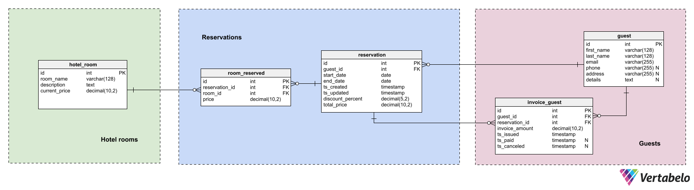
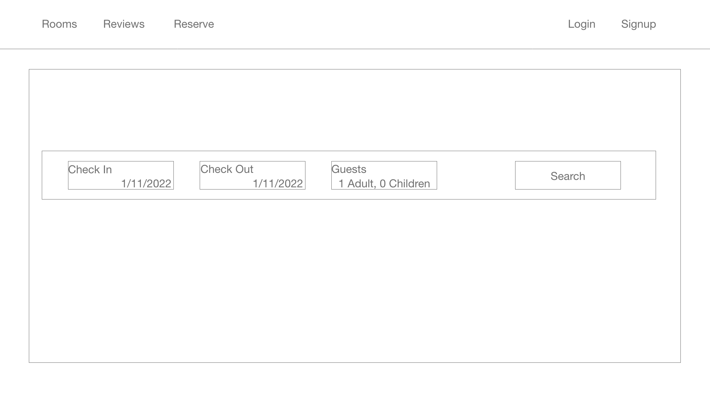
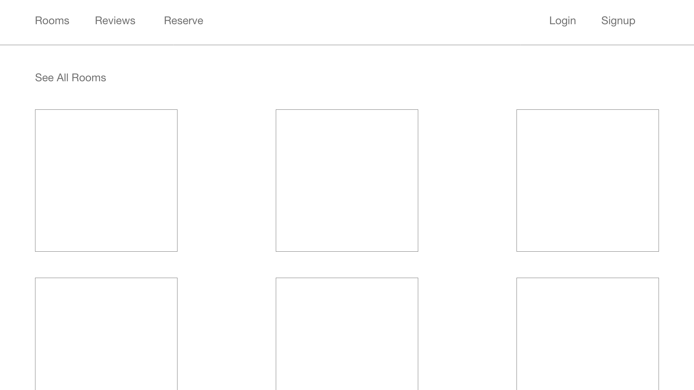
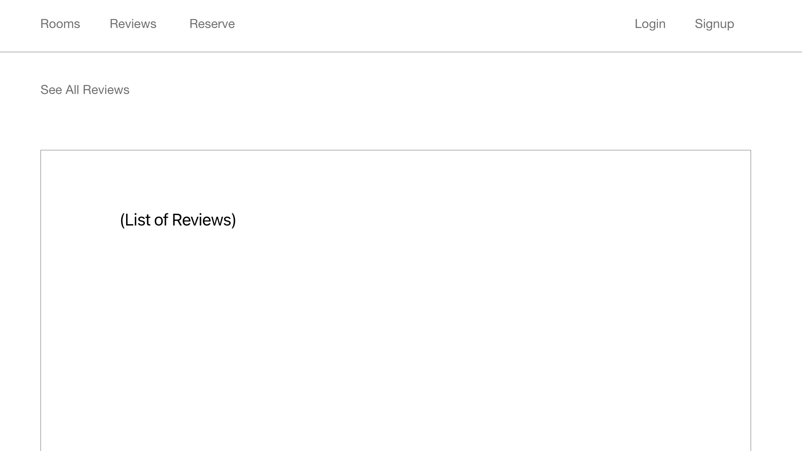

# Wagon Wheel Hotel

## Entity Relationship Diagram



## Wireframes





## Endpoints

### As a guest user, I can:

- Signup
- Log into and out from the site
- View all available rooms
- Request to reserve a room
  - Modify or delete the request
- Create a review for the room
  - Modify or delete the review

### As an admin user, I can:

- Log into and out from the site
- View all rooms (including available and not available)
- Accept or reject request for the room
- See all guests
- See all reservations
- See all reviews

### Directory:

```
.
├── CONTRIBUTING.md
├── Gemfile
├── Gemfile.lock
├── LICENSE.md
├── Procfile
├── Procfile.dev
├── README.md
├── Rakefile
├── app
│   ├── channels
│   ├── controllers
│   │   ├── application_controller.rb
│   │   ├── reservations_controller.rb
│   │   ├── rooms_controller.rb
│   │   └── users_controller.rb
│   ├── jobs
│   ├── mailers
│   ├── models
│   │   ├── application_record.rb
│   │   ├── reservation.rb
│   │   ├── room.rb
│   │   └── user.rb
│   ├── serializers
│   │   ├── reservation_serializer.rb
│   │   ├── reservation_with_user_and_room_serializer.rb
│   │   ├── room_serializer.rb
│   │   └── user_serializer.rb
│   └── views
├── bin
│   ├── rails
│   ├── rake
│   ├── setup
│   └── spring
├── client
│   ├── README.md
│   ├── build
│   ├── package-lock.json
│   ├── package.json
│   ├── public
│   └── src
│       ├── components
│       │   ├── App.js
│       │   ├── Auth.js
│       │   ├── Login.js
│       │   ├── NavBar.js
│       │   ├── ReservationList.js
│       │   ├── ReservationRow.js
│       │   ├── ReviewList.js
│       │   ├── ReviewRow.js
│       │   ├── RoomCard.js
│       │   ├── RoomList.js
│       │   ├── Router.js
│       │   └── SignUp.js
│       ├── index.css
│       ├── index.js
│       └── pages
│           ├── Home.js
│           ├── Reservations.js
│           ├── Reviews.js
│           ├── Rooms.js
│           └── logo.svg
├── config
├── config.ru
├── db
│   ├── migrate
│   │   ├── 20220513094708_create_users.rb
│   │   ├── 20220513094822_create_reservations.rb
│   │   └── 20220513094943_create_rooms.rb
│   ├── schema.rb
│   └── seeds.rb
├── lib
├── log
├── package-lock.json
├── package.json
├── public
├── spec
├── storage
└── tmp

39 directories, 127 files

```

## Requirements

- Ruby 2.7.4
- NodeJS (v16), and npm
- Heroku CLI
- Postgresql

## What's working:

- Authentication / Authorization users

## What's was working:

- Logging in
- Creating reservations (both in Postman and with React form) stopped working.

## What's not working:

- Searching engine for getting reservations
- Username does not stay persistant after logging in
- Deployment
- styling

## Mistakes:

- Spent too much time trying to install styling libraries like Tailwindcss to this outdated repo
- Had too large entity relationship model to handle.
  - Spent too much time getting rid of models, fixing schema, migrating and seeding.
- Not being more descriptive in git commits
  - was rektless in deleting files (Login.js) and adding new components (Dialog)
